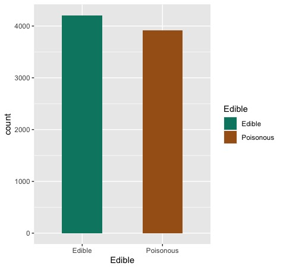
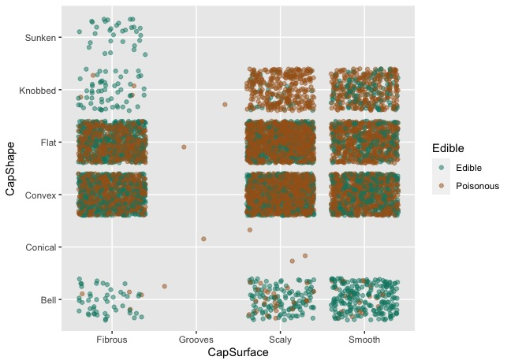
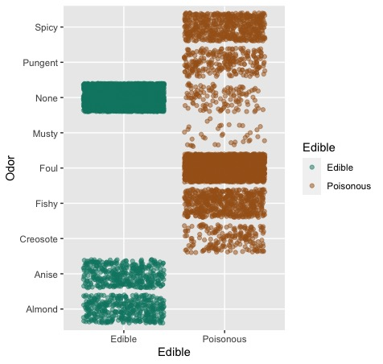
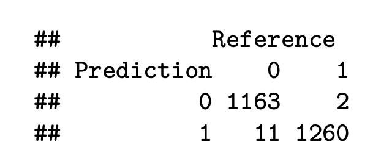
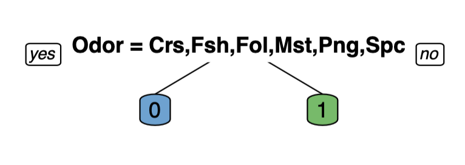
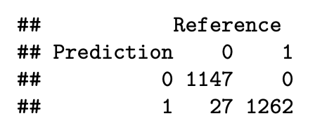
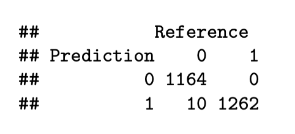
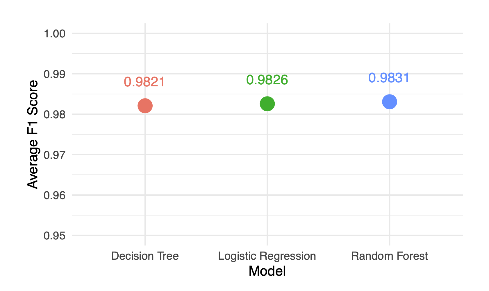
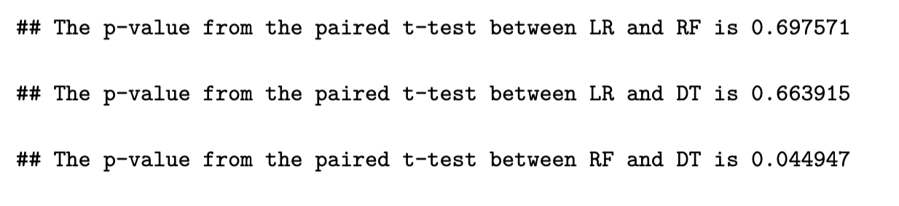

Can I eat that mushroom ?
=========================
Prajwal Amin


# Introduction

Mushrooms are now a staple of the human diet and are enjoyed in many different culinary traditions around the world. Though it has become a concern when consuming them because they are believed to have negative effects on human health. Therefore, it is essential to distinguish between edible and poisonous mushrooms in order to ensure the safety of those who solely depend on them. In this analysis, we will apply different models such as logistic regression, decision trees and random forests for predicting the edibility of the mushrooms. Additionally, will assess and contrast these models using various metrics and report the model that accurately categorizes the mushrooms' edibility. \


# Data Exploration

The data used in this analysis is the "mushrooms.csv" dataset which contains records of different specimens of gilled mushrooms measured in terms of their visual and olfactory information. The observations are drawn from The Audubon Society Field Guide to North American Mushrooms (1981). The data set comprises of 6 attributes which are non-numeric factors: 

- Edible: target variable describing the edibility of the mushrooms whether edible or     poisonous.
- CapShape: shape of the mushroom's cap (eg., bell, conical, convex, etc.)
- CapSurface: surface of the mushroom's cap (eg., fibrous, grooves, smooth, etc.)
- CapColor: color of mushroom's cap.
- Odor: smell of the mushroom (eg., fishy, almond, pungent, etc.)
- Height: describes the height of the mushroom whether tall or short.

The total number of observations were found to be 8124 out of which no missing
values were present. The target variable *Edible* is converted to binary: 1 (Edible) and 0 (Poisonous) to fulfill the constraints of the models. Figure 2 shows that out of 8124 records 4208 mushrooms were found to be edible while the rest of them are poisonous. 



Jitter plot would be an ideal way to visualize the characteristics of the categorical features present in this case. Hence we will feature this plot that describes the relationship between 'CapSurface' and 'CapShape'. According to figure 3 most of the mushrooms which are shaped *convex* or *flat* turn out to be poisonous, however the *bell* shaped mushrooms appear safe to be consumed. In terms of 'CapSurface', *fibrous* are found to be being somewhat edible compared to the rest, besides very few mushrooms with *grooves* surface are observed.








Figure 4 gives a clear indicator that 'Odor' is a determinant feature in predicting the edibility of mushrooms. Mushrooms which emit *Anise* and *Almond* odor in nature are seen to be clearly edible while the rest are poisonous. Likewise the ones with neutral odor have mixed possess mixed edibility. Since the graph already highlights the importance of this feature, we will further determine its importance compared to the other features in modelling the outcome while training different models.


# Model Training

In this section, we will employ three classification models: Logistic Regression, Decision Trees and Random Forests to predict the edibility of the mushrooms. Rather than creating a simplified version, we will tune the models in a way that they are capable of achieving maximum performance. Each of these methods comes with a unique set of hyperparameters, and thus will be chosen so they optimize the model very well.

To fit the data to the subsequent models, we will have to split them according to training and testing. We can achieve this using the function *createDataPartition* from **caret** package. This also makes sure that both the training and test sets are stratified sampled.


``` r

# Splitting the data into training & testing(70:30)
set.seed(123)
splitIndex <- createDataPartition(mush$Edible, p = .7, list = FALSE, times = 1)
train <- mush[splitIndex,]
test  <- mush[-splitIndex,]

```


## Logistic Regression

We apply logistic regression, a popular statistical method for binary classification problems, to predict mushroom edibility. The model is implemented using the **glmnet** package in R, which applies regularization to the model and thus can help prevent overfitting. This is particularly useful for this dataset where there is a large number of potential predictors relative to the number of observations.

``` r

# Training the model
logit_model <- glmnet(x_train, y_train, family =  "binomial", alpha = best_alpha, 
                      lambda = best_lambda)

```

The *alpha* and *lambda* were chosen using cross-validation to optimize the model. Lasso has found to be the suitable regularization technique in this scenario. After this tuning process, we can assess the performance of the model using *confusion matrix*.

``` r

# Making predictions
logit_pred_probs <- predict(logit_model, newx = x_test, type = "response")
logit_preds <- ifelse(logit_pred_probs > 0.5, 1, 0)

# Confusion matrix
logit_preds <- as.factor(logit_preds)
con_log <- confusionMatrix(logit_preds, y_test)
con_log$table

```



This implementation of logistic regression served as our first model in predicting mushroom edibility. The subsequent sections describe our implementations of decision trees and random forests, which we will later evaluate and compare with this model.

## Decision Trees

A decision tree identifies the best split by which it further partitions the data leading towards a *leaf* node that denotes the outcome. This model was employed using the **rpart** package. The tree's complexity can be controlled via the complexity paramter (cp) to prevent overfitting, which has been chosen using cross-validation.


``` r

# Training the model with the optimal cp parameter
final_tree <- rpart(Edible ~ .,
                    data = train,
                    control = rpart.control(cp = optimal_cp),
                    method = "class")

# Visualize
prp(final_tree, box.palette = "auto", tweak=1.8)

```



Referring to figure 4, the decision tree confirms that 'Odor' is indeed an important feature by selecting it as the *root* node for the split. Mushrooms which emit *odor* properties of Almond, Anise or None are classified as *Edible* and the rest as *Poisonous*. Let us retreive a *confusion matrix* for this model as well.

``` r
# Predictions
tree_preds <- predict(final_tree, newdata = test, type = "class")

# Confusion matrix
con_dt <- confusionMatrix(tree_preds, test$Edible)
con_dt$table
```



## Random Forests

Ensembles are used to overcome the lack of performance accomplished by an individual model, which is why we utilize random forests. The **randomForest** package helps to define the model in r. Allthough this model contains a lot of hyperparameters that can be tweaked, we will only deal with *mtry* using best identified value and set *nTree = 1000*.


``` r
# Training the model with the optimal mtry paramter
final_rf <- randomForest(Edible ~ .,
                         data = train,
                         ntree = 1000,
                         mtry = best_mtry,
                         importance = TRUE)

```

Since, the model has been trained by tweaking the necessary parameters, this model can now be used for predictions by which we can evaluate its performance.

``` r 
# Predictions
rf_preds <- predict(final_rf, newdata = test)

# Confusion matrix
con_rf <- confusionMatrix(rf_preds, test$Edible)
con_rf$table

```



Thus the above defined models have performed quite well in predicting the edibility of the mushrooms, but have miss classified *poisonous* mushrooms to be *edible*, which might raise some serious concerns. On the other hand, except for logistic regression neither of the other two have miss categorized true *edible* mushrooms to be *poisonous*. In the upcoming section, we will compare and evaluate all of these models against each other and secure the model that has surpassed in performance.


# Model Selection

After implementing and optimizing logistic regression, decision tree and random forest models, we now proceed towards the model selection stage. The process for model selection comprises of two key steps: **cross-validation** for performance evaluation and **statistical tests** for comparative analysis. Through cross-validation, we can robustly measure a model's predictive power by partitioning the data into multiple subsets (folds) and then repetitively training and testing the model on diverse fold combinations. We then employ the F1 score as our performance metric, a choice driven by its suitability for imbalanced datasets and its consideration of both type I and type II errors. Post performance assessment via cross-validation, we further scrutinized the models using paired t-tests to ascertain if observed performance differences were statistically significant or attributable to randomness. Subsequent subsections will provide a detailed exploration of each component of our model selection approach.

## Cross-Validation

We define the number of *k-folds = 10*. This creates 10 subsets of data (training & testing), using which the models are trained and evaluated *k* times and their respective *f1-scores* is achieved. Note that, optimized versions of the models are used in order to perform effectively.


``` r
# Cross-validaiton
for (iteration in 1:k){
    # Create train and test out of the folds
    train_cv <- train[folds[[iteration]], ]
    test_cv <- train[-folds[[iteration]], ]

    # Logistic Regression
    # Convert data to the format required by glmnet
    x_traincv <- model.matrix(Edible ~ . - 1, train_cv)
    y_traincv <- train_cv$Edible
    x_testcv <- model.matrix(Edible ~ . - 1, test_cv)
    y_testcv <- test_cv$Edible

    current_model_glmnet <- glmnet(x_traincv, y_traincv,
                          family =  "binomial",
                          alpha = best_alpha,
                          lambda = best_lambda)

    # Make predictions
    predictions_glmnet <- predict(current_model_glmnet,
                                  newx = x_testcv, 
                                  type = "response")
    predictions_log <- ifelse(predictions_glmnet > 0.5, 1, 0)
    predictions_log <- as.factor(predictions_log)

    # Calculate F1-score
    cf_log <- confusionMatrix(predictions_log, y_testcv)
    f1_score[1] <- 2 * cf_log$byClass["Sensitivity"] * cf_log$byClass["Pos Pred Value"] /
    (cf_log$byClass["Sensitivity"] + cf_log$byClass["Pos Pred Value"])

    # Decision Tree
    current_model_dt <- rpart(Edible ~ .,
                        data = train_cv,
                        control = rpart.control(cp = optimal_cp),
                        method = "class")
    # Make predictions
    predictions_dt <- predict(current_model_dt,
                              newdata = test_cv,
                              type = "class")

    # Calculate F1-score
    accuracy[2] <- mean((predictions_dt) == y_testcv)
    cf_dt <- confusionMatrix(predictions_dt, test_cv$Edible)
    f1_score[2] <- 2 * cf_dt$byClass["Sensitivity"] * cf_dt$byClass["Pos Pred Value"] /
    (cf_dt$byClass["Sensitivity"] + cf_dt$byClass["Pos Pred Value"])

    # Random Forest
    current_model_rf <- randomForest(Edible ~ .,
                                  data = train_cv,
                                  ntree = 1000,
                                  mtry = best_mtry,
                                  importance = TRUE)
    
    # Make predictions
    predictions_rf <- predict(current_model_rf, 
                              newdata = test_cv)

    # Calculate F1-score
    accuracy[3] <- mean((predictions_rf) == y_testcv)
    cf_rf <- confusionMatrix(predictions_rf, test_cv$Edible)
    f1_score[3] <- 2 * cf_rf$byClass["Sensitivity"] * cf_rf$byClass["Pos Pred Value"] / 
    (cf_rf$byClass["Sensitivity"] + cf_rf$byClass["Pos Pred Value"])

    # Storing the f1 scores
    f1_scores[iteration, ] <- f1_score

  }

```

The average f1-scores from the 10-fold cross-validation for each model can be visualized using a graph. This graphical representation allows for a direct and easy comparison of the models' performances.



After performing cross-validation, random forest has resulted to have obtained higher score on average, but the difference is remarkably close with logistic regression and decision tree. This suggests that all three models offer a comparably good balance of precision and recall in predicting mushroom edibility based on the given attributes. The near-equal performance across all three models is an interesting outcome, which might be attributed to the nature of the dataset. It is possible that the given attributes allow for a clear demarcation between edible and non-edible mushrooms, and thus, even the simplest model (logistic regression) is able to capture this distinction as effectively as the more complex models (decision tree and random forest).

This outcome underscores the importance of model selection based on the dataset in hand, as well as the usefulness of cross-validation and performance metrics like the f1 score in ensuring robust comparisons of different models. In the next section, we will delve into the statistical comparisons of the models' performances using paired t-tests.


## Statistical Tests

To further bolster the model selection process we will perform *paired t-test* on the models to determine their statistical significance in this scenario. Since there are three models, we conduct three pairs of t-tests and retrieve their respective *p-values*.

``` r
# Perform paired t-test between each pair
ttest_result_LR_RF <- t.test(f1_scores[, iLR], f1_scores[, iRF], paired = TRUE)$p.value
ttest_result_LR_DT <- t.test(f1_scores[, iLR], f1_scores[, iDT], paired = TRUE)$p.value
ttest_result_RF_DT <- t.test(f1_scores[, iRF], f1_scores[, iDT], paired = TRUE)$p.value
```




While the p-value resulted from the t-test conducted between the first two pairs are > 0.05, the p-value for the random forest and decision tree is $\approx 0.045$ (< 0.05), which signifies that there is a statistically significant difference between these two models. Therefore, we can infer that Random Forest significantly outperforms Decision Trees in predicting mushroom edibility with the data set in hand.

In conclusion, while all three models demonstrated competent performance, the Random Forest model showed a slightly higher average F1 score and statistically significant better performance than the Decision Tree model. However, given the statistical results and the closeness of the F1 scores, it's also possible that the Logistic Regression and Decision Tree models may perform better in some scenarios. This emphasizes the importance of considering the specific nature of the dataset and the predictive attributes when choosing a model.


# Conclusion

The report aimed to utilize and compare three different models: Logistic Regression, Decision Tree and Random Forest for predicting mushroom edibility based on several categorical attributes. Each model was efficiently optimized to improve the performance. Model selection was done through cross-validation, and their performance was measured based on the F1 score, a commonly used metric for balanced data sets. All the models had achieved significantly high F1 scores, demonstrating their effectiveness in classifying mushroom edibility.

Despite all models demonstrating commendable performance, Random Forest emerged as the top-performing model based on F1 score. However, statistical significance tests showed that the performances of Logistic Regression, Decision Tree and Random Forest were not significantly different from each other. This indicates that all three models, given the nature of this particular data set, are effective at predicting mushroom edibility. Although Random Forest showed a slightly higher F1 score, it's also possible that Logistic Regression and Decision Trees might perform better in certain scenarios.

To conclude, the effective application of the models for predicting mushroom edibility as seen in this study sets the stage for future exploration in the field. Subsequent studies could incorporate diverse models tuned carefully for specific cases, apply new features, or test these models on different data sets to possibly enhance the predictability of mushroom edibility. While these developments are exciting, it is crucial to keep in mind that when it comes to determining whether it is safe to eat foraged mushrooms, no predictive model can or should replace expert knowledge and resources. In cases when the model produces precise results, their true value must only be realized by using them responsibly.
